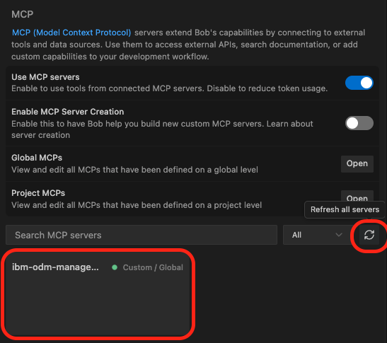

# IBM Bob Integration Guide

## Prerequisites

### 1. Install IBM Bob
- IBM Bob is in early access with limited availability. Click [Sign up](https://www.ibm.com/products/bob#Form) and fill in the form to request access to IBM Bob.
- Then follow the [instructions](https://internal.bob.ibm.com/docs/ide/install#install-ibm-bob) to install IBM Bob.

### 2. Install Git, Python and uv

1. [Install Git](https://git-scm.com/install/windows) (you can keep the default options)
1. Install Python 3.13 or later
1. Install uv:
    - on macOS: 
        ```shell
        brew install uv
        ```
    - on Windows: 
        1. in PowerShell, run the command described in [installing uv](https://docs.astral.sh/uv/getting-started/installation/)
        1. once `uv` is installed, open a new PowerShell tab, and run the command below:
            ```powershell
            uv tool install git+https://github.com/DecisionsDev/ibm-odm-management-mcp-server
            ```
        1. run the command below in PowerShell:
            ```powershell
            New-Item -ItemType SymbolicLink -Path "$(Split-Path (Get-Command git).Source -Parent)\git" -Target (Get-Command git).Source
            ```
            > Note:
            > This command creates a symbolic link named `git` to `git.exe` to prevent the errors below (from happening whenever the GitHub repository was updated and uvx calls git to fetch the changes): 
            > ```
            > 2025-12-31T10:29:46.477Z [ibm-odm-management-mcp-server] [info] Message from client: {"method":"initialize","params":{"protocolVersion":"2025-06-18","capabilities":{},"clientInfo":{"name":"claude-ai","version":"0.1.0"}},"jsonrpc":"2.0","id":0} { metadata: undefined }
            >    Updating https://github.com/DecisionsDev/ibm-odm-management-mcp-server (HEAD)
            >   × Failed to download and build `decisioncenter-mcp-server @
            >   │ git+https://github.com/DecisionsDev/ibm-odm-management-mcp-server@bbb8a86091410aa1f8a9fa458c43a6fba38596f3`
            >   ├─▶ Git operation failed
            >   ╰─▶ Git executable not found. Ensure that Git is installed and available.
            > ```

1. Verify your Python and `uv` installation:

    Run the command below (in a terminal or PowerShell):
    ```
    uv python list
    ```
    You should see the version(s) of Python you have installed.

### 3. Install Docker or Rancher Desktop (Optional)

This step is optional and only needed if you choose to run ODM as a container on your laptop using the ODM for Developer image. Alternatively you can use an ODM deployment running on a server.

Here are the steps to install Rancher Desktop if you chose this application to run containers:
- on Mac:
    1. Download the installer from [Rancher Desktop website](https://rancherdesktop.io/)
    1. Open the downloaded .dmg file and drag Rancher Desktop to your Applications folder
    1. Launch Rancher Desktop from your Applications folder
        - In the settings, select "dockerd" as the container runtime (not "containerd")
    1. Verify the installation:
        - Open a Terminal
        - Run the following commands:
            ```bash
            docker --version
            docker compose --version
            ```
        - These commands should display the installed versions, confirming that Docker and Docker Compose are properly installed

- on Windows:
    1. Install WSL 2 (Windows Subsystem for Linux)
        - Open PowerShell as Administrator and run:
            ```powershell
            wsl --install
            ```
        - Restart your computer when prompted
        - After restart, a Linux distribution (usually Ubuntu) will be installed automatically
        - Set up your Linux username and password when prompted (ex: admin/admin)
    1. Download the installer from [Rancher Desktop website](https://rancherdesktop.io/)
    1. Run the installer and follow the on-screen instructions
    1. Run Rancher Desktop
        - Disable Kubernetes (Not needed for this demonstration)
        - Wait until the initialization was finished.
        - Ensure WSL integration is enabled
        - Select "dockerd" as the container runtime (not "containerd")
        - After installation, Rancher Desktop will start automatically
    1. Verify the installation:
        - Open a PowerShell window
        - Run the following commands:
            ```bash
            docker --version
            docker compose --version
            ```
        - These commands should display the installed versions, confirming that Docker and Docker Compose are properly installed

### 4. Run ODM for Developer

This step is optional and only needed if you choose to run ODM as a container on your laptop using the ODM for Developer image. Alternatively you can use an ODM deployment running on a server.

- clone this repository,
    ```bash
    git clone https://github.com/DecisionsDev/ibm-odm-management-mcp-server.git
    cd ibm-odm-management-mcp-server
    ```
- run:
    **For macOS/Linux (in Terminal) and Windows (in PowerShell):**
    ```bash
    docker compose up
    ```    
    If the command is successful, you should see:
    ```
    [+] Running 1/1
    ✅ Container odm Running
    ```

- Once the containers are running, the ODM web consoles are available at [http://localhost:9060](http://localhost:9060) using the default credentials:

  - **Username:** `odmAdmin`
  - **Password:** `odmAdmin`

## Configure IBM Bob

1. To access the MCP settings panel, click the 3 dots next to the gear icon in the upper right corner of the chat window. Then, select MCP servers from the dropdown menu.

    

1. Ensure that `Use MCP servers` is enabled and Click the `Open` button next to `Global MCPs` or `Project MCPs` to edit the MCP configuration:
    - the configuration can be set at two levels: global (applied across all workspaces) or project-specific (stored in `.bob/mcp.json` within your project root, making it easy to share with teams through version control).

    

1. This opens the configuration file chosen. If you chose to edit the global settings:
   - macOS: `~/.bob/settings/mcp_settings.json`
   - Windows: `%APPDATA%\IBM Bob\User\globalStorage\ibm.bob-code\settings\mcp_settings.json`

1. Edit the configuration file and add the following configuration:
   ```json
   {
     "mcpServers": {
       "ibm-odm-management-mcp-server": {
         "command": "uvx",
         "args": [
           "--from", "git+https://github.com/DecisionsDev/ibm-odm-management-mcp-server", "ibm-odm-management-mcp-server",
           "--url",      "http://localhost:9060/decisioncenter-api",
           "--res-url",  "http://localhost:9060/res",
           "--username", "odmAdmin"
         ],
         "env": {
           "PASSWORD": "odmAdmin"
         }
       }
     }
   }
   ```

1. Save the file and then click the `Refresh all servers` icon. After some time, the `ibm-odm-management-mcp-server` MCP server will get displayed.

    

## Demo walkthrough

With the configuration above, the Management MCP Server 
- connects to the IBM ODM Developer Edition container which embeds a sample database containing two decision services:
    1. **Loan Validation Service**
    2. **Miniloan Service**
- exposes the Decision Center REST API endpoints and the RES console REST API endpoints as tools.

### Example 1: Decision Center REST API

- Enter the following text and press ENTER:
    ```
    Create a group named 'Miniloan Users' with rtsUser1 and rtsUser2 as members and with full authoring permissions
    ```
- **Bob** creates the group by running the `addGroup` tool with the parameters
  ```
  {
    'name': 'Miniloan Users',
    'users': [
      'rtsUser1',
      'rtsUser2'
    ],
    'securityProfile': 'FULLACCESS'
  }
  ```

### Example 2: RES console REST API

- Enter the following text (and press ENTER):
    ```
    Get the execution statistics
    ```

- **Bob** lists the execution units, the ruleapps and rulesets, and their statistics of executions, and generates a report:

    >🎉 **Task Completed**
    >
    >**Execution Unit Information**
    >- Server Name: localhost
    >- Execution Unit: xuHTDS
    >- Product Version: 9.5.0.1.1
    >- Status: 46 warnings, 0 errors
    >
    >Execution statistics query completed for the available rulesets. The queries returned no response, which indicates that no execution statistics have been recorded yet for the rulesets in the repository.
    >
    >This typically means:
    >
    >- The rulesets have not been executed yet, or
    >- Execution statistics collection is not enabled, or
    >- The statistics have been reset
    >
    >**Available RuleApps**
    >
    >The system has 3 RuleApps deployed:
    >
    >1. mydeployment (1.0) - 7 ruleset versions
    >1. production_deployment (1.0) - 1 ruleset
    >1. test_deployment (1.0) - 2 rulesets

- Enter the following text:
    ```
    Enable monitoring on all the rulesets
    ```

- **Bob** runs the `addRulesetProperty` to set the property `monitoring.enabled` to `true` on all the rulesets to enable recording the statistics of execution of those rulesets.

### Example 3: combining the Decision MCP server and Management MCP server

- To enable both MCP servers, edit the configuration file as follows:
   ```json
   {
        "mcpServers": {
            "ibm-odm-management-mcp-server": {
                "command": "uvx",
                "args": [
                    "--from", "git+https://github.com/DecisionsDev/ibm-odm-management-mcp-server", "ibm-odm-management-mcp-server",
                    "--url",      "http://localhost:9060/decisioncenter-api",
                    "--res-url",  "http://localhost:9060/res",
                    "--username", "odmAdmin",
                ],
                "env": {
                    "PASSWORD": "odmAdmin"
                }
            }
            "ibm-odm-decision-mcp-server": {
                "command": "uvx",
                "args": [
                    "--from", "git+https://github.com/DecisionsDev/ibm-odm-decision-mcp-server", "ibm-odm-decision-mcp-server",
                    "--url", "http://localhost:9060/res",
                    "--username", "odmAdmin",
                ],
                "env": {
                    "PASSWORD": "odmAdmin"
                }
            }
        }
    }
    ```
- Enter the following text (and press ENTER):
    ```
    I would like to borrow $2,000,000
    ```
- **Bob** runs the `miniloan_serviceoperation` tool and reports:

    >Your loan request for $2,000,000 has been denied.
    >
    >Reason for denial:
    >The loan amount exceeds the maximum allowed limit of $1,000,000.

- Enter the following text:
    ```
    find which rule enforces this maximum
    ```
- **Bob** runs `decisionServices` first to list the Decision Services and then `rules` to :

    >I found the rule that enforces the maximum loan amount!
    >
    >**Rule Name**: `maximum amount`
    >
    >**Rule Location**:
    >- Decision Service: Miniloan Service
    >- Folder: validation
    >
    >**Rule Definition:**
    >```
    >if 
    >   the amount of 'the loan' is more than 1,000,000 
    >then
    >   add "The loan cannot exceed 1,000,000" to the messages of 'the loan';
    >   reject 'the loan' ;
    >```
    >
    >**Rule Details:**
    >
    >- Created by: odmAdmin
    >- Created on: March 15, 2024 at 10:22:36 CET
    >- Status: Active
    >- Type: Action Rule (brm.ActionRule)
    >- This rule checks if the loan amount exceeds $1,000,000 and automatically rejects the loan with the message "The loan cannot exceed 1,000,000" if it does.
    >
    >Permalink to rule in Decision Center:
    >http://localhost:9060/decisioncenter/t/library/editor?datasource=jdbc%2FilogDataSource&id=brm.ActionRule:23:23&baselineId=brm.Branch:31:31
    >
- Enter the following text:
    ```
    download the decision service and change this maximum to 2,000,000
    ```

- **Bob** runs `decisionServiceExport` which returns an archive and then unzips it:
    >```
    >cd /Users/fred && unzip -q Miniloan-Service_main_bg6qld2l.zip -d agent-miniloan-temp && find agent-miniloan-temp -name "maximum amount.brl"
    >```
    ```
    Archive:  Miniloan-Service_main_bg6qld2l.zip
      inflating: agent-miniloan-temp/Miniloan Service/resources/xom-libraries/miniloan-xom.zip  
      creating: agent-miniloan-temp/Miniloan Service/.validation
      inflating: agent-miniloan-temp/Miniloan Service/.ruleproject  
      creating: agent-miniloan-temp/Miniloan Service/templates
      inflating: agent-miniloan-temp/Miniloan Service/bom/miniloan.bom  
      inflating: agent-miniloan-temp/Miniloan Service/bom/miniloan_en.voc  
      inflating: agent-miniloan-temp/Miniloan Service/.project  
      inflating: agent-miniloan-temp/Miniloan Service/deployment/Miniloan.dep  
      inflating: agent-miniloan-temp/Miniloan Service/deployment/Miniloan ServiceOperation.dop  
      creating: agent-miniloan-temp/Miniloan Service/queries
      inflating: agent-miniloan-temp/Miniloan Service/rules/validation/.rulepackage  
      inflating: agent-miniloan-temp/Miniloan Service/rules/validation/maximum amount.brl  
      inflating: agent-miniloan-temp/Miniloan Service/rules/eligibility/.rulepackage  
      inflating: agent-miniloan-temp/Miniloan Service/rules/eligibility/repayment and score.dta  
      inflating: agent-miniloan-temp/Miniloan Service/rules/eligibility/minimum income.brl  
      inflating: agent-miniloan-temp/Miniloan Service/rules/eligibility/minimum credit score.brl  
      inflating: agent-miniloan-temp/Miniloan Service/rules/Miniloan ServiceParameters.var  
      inflating: agent-miniloan-temp/Miniloan Service/rules/miniloan.rfl  
    ```

- **Bob** reads the file, edits it and ask to confirm the modification:
    ```xml
    <?xml version="1.0" encoding="UTF-8"?>
    <ilog.rules.studio.model.brl:ActionRule xmi:version="2.0" xmlns:xmi="http://www.omg.org/XMI" xmlns:ilog.rules.studio.model.brl="http://ilog.rules.studio/model/brl.ecore">
    <name>maximum amount</name>
    <uuid>45d4e486-039b-41a9-833c-b69990fe53df</uuid>
    <locale>en_US</locale>
    <definition><![CDATA[if
    the amount of 'the loan' is more than 2,000,000
    then
    add "The loan cannot exceed 2,000,000" to the messages of 'the loan' ;
    reject 'the loan' ;]]></definition>
    </ilog.rules.studio.model.brl:ActionRule>
    ```
- **Bob** zips the files:
    > ```
    > cd /Users/fred/agent-miniloan-temp && zip -r ../Miniloan-Service-modified.zip "Miniloan Service"
    > ```
    ```
        adding: Miniloan Service/ (stored 0%)
        adding: Miniloan Service/.validation/ (stored 0%)
        adding: Miniloan Service/bom/ (stored 0%)
        adding: Miniloan Service/bom/miniloan_en.voc (deflated 71%)
        adding: Miniloan Service/bom/miniloan.bom (deflated 56%)
        adding: Miniloan Service/resources/ (stored 0%)
        adding: Miniloan Service/resources/xom-libraries/ (stored 0%)
        adding: Miniloan Service/resources/xom-libraries/miniloan-xom.zip (stored 0%)
        adding: Miniloan Service/.ruleproject (deflated 72%)
        adding: Miniloan Service/queries/ (stored 0%)
        adding: Miniloan Service/deployment/ (stored 0%)
        adding: Miniloan Service/deployment/Miniloan.dep (deflated 63%)
        adding: Miniloan Service/deployment/Miniloan ServiceOperation.dop (deflated 57%)
        adding: Miniloan Service/.project (deflated 56%)
        adding: Miniloan Service/rules/ (stored 0%)
        adding: Miniloan Service/rules/miniloan.rfl (deflated 69%)
        adding: Miniloan Service/rules/eligibility/ (stored 0%)
        adding: Miniloan Service/rules/eligibility/minimum income.brl (deflated 41%)
        adding: Miniloan Service/rules/eligibility/.rulepackage (deflated 39%)
        adding: Miniloan Service/rules/eligibility/repayment and score.dta (deflated 91%)
        adding: Miniloan Service/rules/eligibility/minimum credit score.brl (deflated 42%)
        adding: Miniloan Service/rules/Miniloan ServiceParameters.var (deflated 48%)
        adding: Miniloan Service/rules/validation/ (stored 0%)
        adding: Miniloan Service/rules/validation/.rulepackage (deflated 39%)
        adding: Miniloan Service/rules/validation/maximum amount.brl (deflated 42%)
        adding: Miniloan Service/templates/ (stored 0%)
    ```
- **Bob** updates the Decision Service by running `branchImport`
- **Bob** finds the deployment configuration by running `deploymentConfigurations`
- **Bob** deploys a new version of the ruleset by running `deploy`
- **Bob** tries to run `miniloan_serviceoperation` again to check that it is now possible to borrow a higher amount 
    > The MCP decision server appears to be using version 1.1 still. Let me check which version it's actually calling and update the agent.enabled property to point to the correct version. Let me check the decision service resource directly:

- **Bob** finds out that the new ruleset is not published as a tool
    > I see the issue! The MCP decision server is still pointing to version 1.1 (/mydeployment/1.0/Miniloan_ServiceRuleset/1.1). I need to update the ruleset property to disable agent.enabled on version 1.1 and enable it on version 1.2. Let me do that:

- **Bob** fixes that by running `updateRulesetProperty` (with the property `agent.enabled` set to `true`)

- **Bob** runs `miniloan_serviceoperation` again and reports: 
    >🎉 **Task Completed**
    >
    >I've successfully modified the maximum loan amount rule from 1,000,000 to 2,000,000 in both the "Miniloan Service" decision service.
    >
    >**What was done:**
    >
    >- Downloaded the Miniloan Service decision service from Decision Center
    >- Modified the "maximum amount" rule in the validation folder:
    >- Changed the condition from is more than 1,000,000 to is more than 2,000,000
    >- Updated the error message from "The loan cannot exceed 1,000,000" to "The loan cannot exceed 2,000,000"
    >- Imported the modified decision service back to Decision Center
    >- Deployed the Miniloan Service (version 1.2) to the execution server
    >- Updated the agent.enabled property to switch from version 1.1 to version 1.2
    >
    >**Current Status:**
    >The decision service has been updated with the new $2,000,000 maximum
    >Version 1.2 of the Miniloan_ServiceRuleset is deployed and active
    >The agent.enabled property has been set to use version 1.2
    >Note: The MCP decision server may need to be restarted to pick up the new ruleset version. The property changes have been made (agent.enabled=false on v1.1, agent.enabled=true on v1.2), but the server might be caching the old version. You may need to restart the IBM Bob application or the MCP server to see the updated $2,000,000 limit take effect.
    >
    >**File modified:**
    >
    >- `/Users/fred/miniloan-temp/Miniloan Service/rules/validation/maximum amount.brl`

## Additional information

- IBM Bob documentation: [Bob docs](https://internal.bob.ibm.com/docs/ide).
- Tutorial: [MCP integration with IBM Bob](https://www.ibm.com/think/tutorials/mcp-integration-ibm-bob)
- Interactive Demo: Click this [link](https://www.ibm.com/products/bob) and then click the "Interactive Demo" button